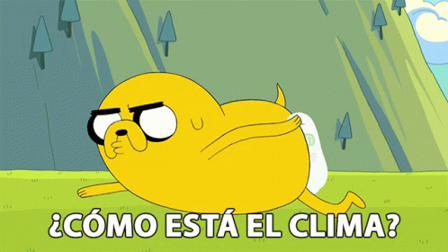

#   ESPAÑOL:

##  <i align="center" style="font-size:2rem">☀️ APLICACIÓN DEL CLIMA HECHA CON REACT</i>

En este proyecto se usaron hooks como **useState,useEffect** , tecnologias como **HTML,CSS,JavaScript,React,SASS**

**_Este proyecto se realizo con el proposito de practicar React_**

## 💡 Como se pensó el proyecto y como funciona

**_Idea Principial: Aplicacion del clima que cuando se busque cualquier lugar del mundo se pueda saber su clima_**

Nota: Ya habia realizado el mismo proyecto pero lo habia realiza con JavaScript Vanilla , por eso tome mucha de las ideas de ese proyecto anterior para aplicarlo a este

APIs usadas en este proyecto:
- Lugares : [GeoDb Cities Api](https://rapidapi.com/wirefreethought/api/geodb-cities/)
- Clima: [WeatherApi](https://www.weatherapi.com/)

La idea principal fue que cuando el usuario realizara una busqueda de cualquier lugar en el mundo , pudiera seleccionar ese lugar en la aplicacion y que se muestre por pantalla el clima y su pronostico para los dias cercanos

Por lo tanto , como componente primer componente y principal realice una Barra de busqueda , que cuando el usuario escriba cualquier caracter dentro de ella , lo que contenga la barra de busqueda se almacenara en un estado llamado **_"Place"_**.
Cree un efecto que posee de dependencia a este estado y por lo tanto cada vez que este cambie se realizara una nueva peticion a la API de **_"GeoDB Api"_** y con la informacion que traiga la respuesta de la API se almacenara en un estado llamdo **_"Places"_**

Con la informacion contenida dentro de **_"Places"_** , la app a traves del renderizado condicional que posee y detecta cuando este estado tiene informacion  y renderiza los componentes de **_"City Irem"_** que poseen el nombre y pais de las ciudades , estos formaran una lista.

Cuando el usuario clickee alguno de estos componentes , las coordenadas de esta ciudad se extraeran y se almacenaran en un estado llamado **_"coordsPlaceSelected"_**. Con esta informacion , se realiza una peticion a la API **_"Weather Api"_** ,y con la informacion de la respuesta de la API , se llenara el estado **_"infoPlaceSelected"_**

Gracias a este estado, cuando la app detecta que posee informacion se renderizan los diferentes componentes que hacen posible que el usuario obtenga la informacion del clima , estos comoponentes son **_"Weather Individial Info Card"_** y **_"Wather Next Days Card"_**

Para los estilos , utilice SASS por que es muy comodo para trabajar e increiblemente eficiente

-------------------------------------------------------------------------------------------
-------------------------------------------------------------------------------------------

#  ENGLISH:

## <i align="center" style="font-size:2rem">🌈 WEATHER APP MADE WITH REACT</i> 

In this proyect was used hooks like **useState,useEffect** and technologies like **HTML,CSS,Javascript,React,Sass**

**_This proyect was built with the purpose of practising React_**

## 🤔 How the project was thought and how it works 

**_Main Idea: Weather app that when user searchs anywhere in the world can be know it weather_**

Note: Already I have a same project but it was built in Vanilla Javascript , so i took a lot of ideas for this project

APIs used in this project:
- Places : [GeoDb Cities Api](https://rapidapi.com/wirefreethought/api/geodb-cities/)
- Weather: [WeatherApi](https://www.weatherapi.com/)

My idea was when user searchs in search bar whatever place in the entire world ,can selects any and when user selects it the app will render the actual weather and weather in the next days

So, I make a Search bar .When user writes any character into it , it will be store in a state called "Place".It state is linked with a useEffect ,so with the info contained into "Place" a request will be make to the **GeoDb Api** and the information that will come in the response ,will store in the State "Places"

With the information contained in "Places" State , The app will render a "City Item",each contains name and country of the place.All of these "City Item" will make a list

When user clicks any "City Item",it´s coordinates are extracted from it and stores in a State called "coordsPlaceSelected".

An useEffect is watching for changes in the State "coordsPlaceSelected" ,so when user fills this state, be will make a request to the **Weather Api** with the information contained into the coords(Latitude and Longitude). The information that will come in the response, will store in the State "infoPlaceSelected"

With the information contained into the state "infoPlaceSelected", will be render "Weather Individual Info Card" and "Weather Next Days Card"

For the Styles ,another time i used SASS .Because i feel so confortable with it